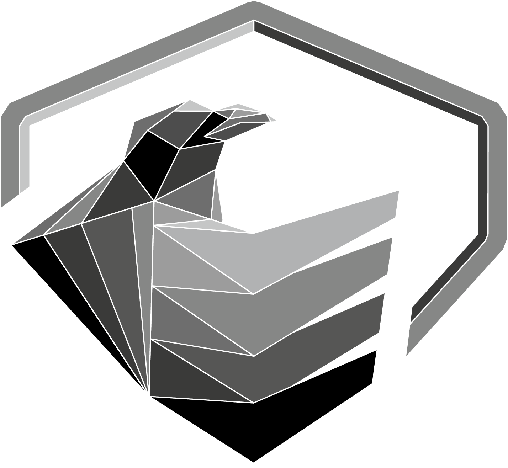

# Rayvyn

rayvyn is a CVE - monitoring - tool, designed to scrape cve-feeds
from NIST and vendors (if possible) and alert (email, slack)
when certain criterias from CVSS-Score are met.

all data is stored in an sqlite-database

### version

- very early alpha

# How to Run

Installations/Setup-Instructions ->see [docs/Manual.md](docs/Manual.md)

# Feeds attached

- NIST/NVD
- Cisco
- RedHat
- PaloAlto

# Changelog

- see [Changelog](docs/changelog.md)
